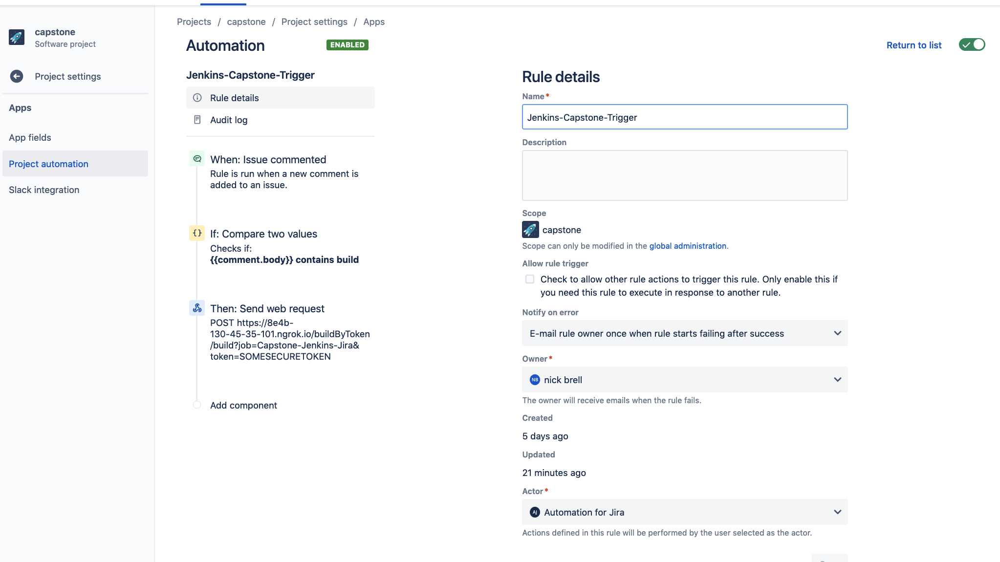

# Capstone
## Description
This is my capstone project that I made during my internship with [Critial Design Associates](https://www.criticaldesign.net/). 

For this project I was instructed to create a REST API with functionality to allow for creation of users and changing of passwords. My API then had to be containerized and available on Docker Hub. Further requirements included using Terraform to setup my infrastructure need to host my Docker image. I then had to integrate my REST API with Jenkins and Jira.


See [minimum requirements](https://github.com/nickb210/capstone/blob/master/minimum%20requirements) for the minimum requirements I was instrcuted to meet for this project.

## How it works / breakdown
### &nbsp;I. Initial Setup
1. My Terraform files are configured to create an EC2 instance on AWS. Once the EC2 instance is complete, [`user-data.sh`](https://github.com/nickb210/capstone/blob/master/deploy/templates/ec2/user-data.sh) will pull my docker image from my DockerHub repository, and run that image making my API accessible to anyone on the internet.

### &nbsp;II. Integration
1. There is an automation rule setup on my Jira project that is trigged when a new comment is added to an issue that contains the word "*build*". This will send a web request to my Jenkins job, which will pull the latest docker image from my DockerHub repository.



2. In `Jenkins`, my job will run the pipeline from my *[Jenkinsfile](https://github.com/nickb210/capstone/blob/master/Jenkinsfile)*. 
    - My *[Jenkinsfile](https://github.com/nickb210/capstone/blob/master/Jenkinsfile)* takes the IP address of the EC2 instance (defined in my `Terraform` output) and saves the IP to a file. Then runs 2 `sed` commands on that file in order to get the address in a desired format so I could `ssh` into my EC2 instance.

        - `Terraform` saves the ouput like such `"123.456.789.012"`, but I formatted it to `123-456-789-012`.
            ```
            ssh -i <someKey.pem> ec2-user@ec2-123-456-789-012.compute-1.amazonaws.com
            ```
    - Then, the `Docker` container currently on the EC2 instance is stopped and removed, then the `Docker` image is removed completely.
    - Then the latest `Docker` image is pulled from my [DockerHub](https://hub.docker.com/repository/docker/nickb09/capstone) repository and ran on my EC2 instance.
    
    
### III. Web Application
1. My Web application consists of 4 different endpoints: `/home`, `/login`, `/signup`, and `/changepassword`.

- `/home`

* `/login`

- `/signup`

- `/changepassword`

